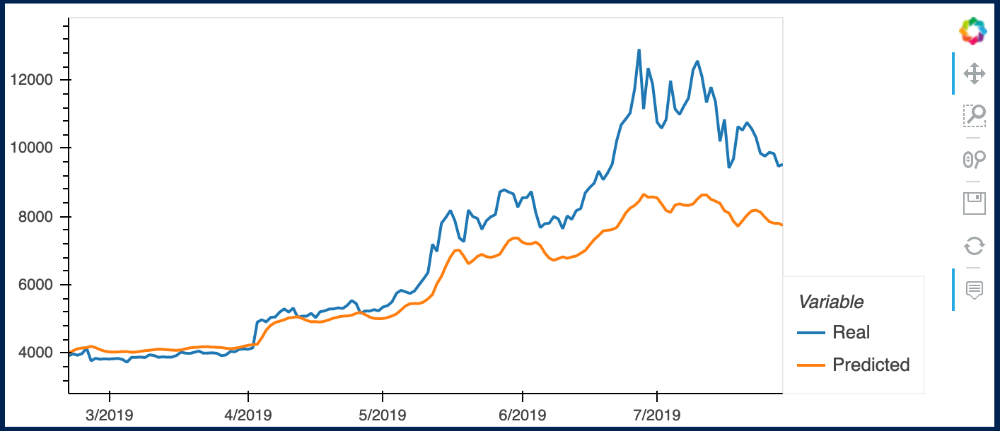
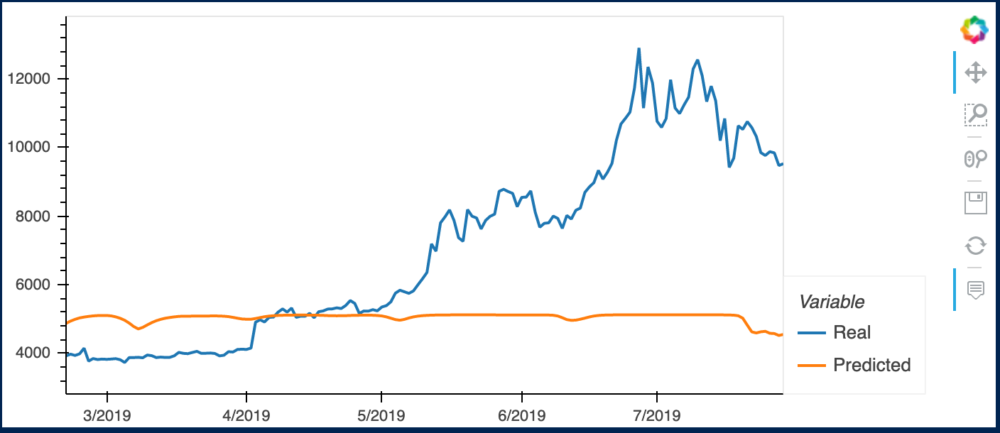
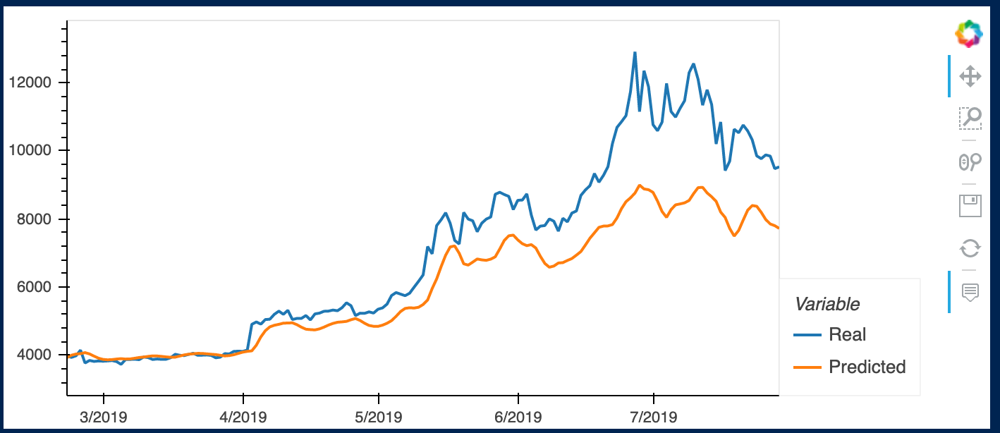
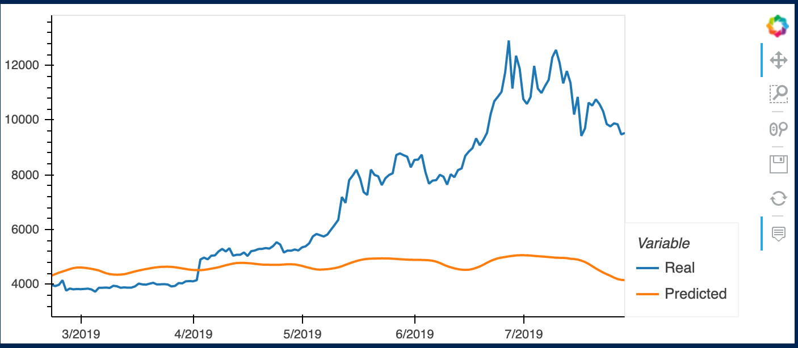

# Results Analysis - LSTM Stock Predictor 

- - -

## Evaluate the performance of each model

### 1/ Parameters
+ window_size = 10
- model: Sequential
- number_units, neurons = 30                
- dropout_fraction = 0.2
+ Layer 1
    - model LSTM  
    - model Dropout
+ Layer 2
    - model LSTM  
    - model Dropout
+ Layer 3
    - model LSTM  
    - model Dropout
+ Output layer
    - model Dense
+ model.compile
    -optimizer="adam"
    -loss="mean_squared_error"  

### 2/ Based on these parameters - two models comparation 
#### 2.1 Closing

#### 2.2 FNG

- - -

### 3 Which model has a lower loss?

##### 3.1 Closing 
5/5 [==============================] - 1s 4ms/step - loss: 0.0250
0.02498834766447544

##### 3.2 FNG
5/5 [==============================] - 1s 4ms/step - loss: 0.1214
0.12143657356500626

- - -

### 4 Which model tracks the actual values better over time?

##### 4.1 Closing (this model tracks better actual values)

                Real	Predicted
2019-02-20	3924.239990	3997.045166  
2019-02-21	3974.050049	4068.318604  
2019-02-22	3937.040039	4125.502441  
2019-02-23	3983.530029	4148.861328  
2019-02-24	4149.089844	4159.145020  

##### 4.2 FNG

                Real	Predicted
2019-02-20	3924.239990	4871.794922  
2019-02-21	3974.050049	4939.271973  
2019-02-22	3937.040039	4990.559570  
2019-02-23	3983.530029	5031.798828  
2019-02-24	4149.089844	5056.754395  

- - -

### 5 Which window size works best for the model?

##### 5.1 Closing (Win = 15,  improves predictions, over 15 there is not much change)

##### 5.2 FNG (Win = 15, still low performance)

- - -

